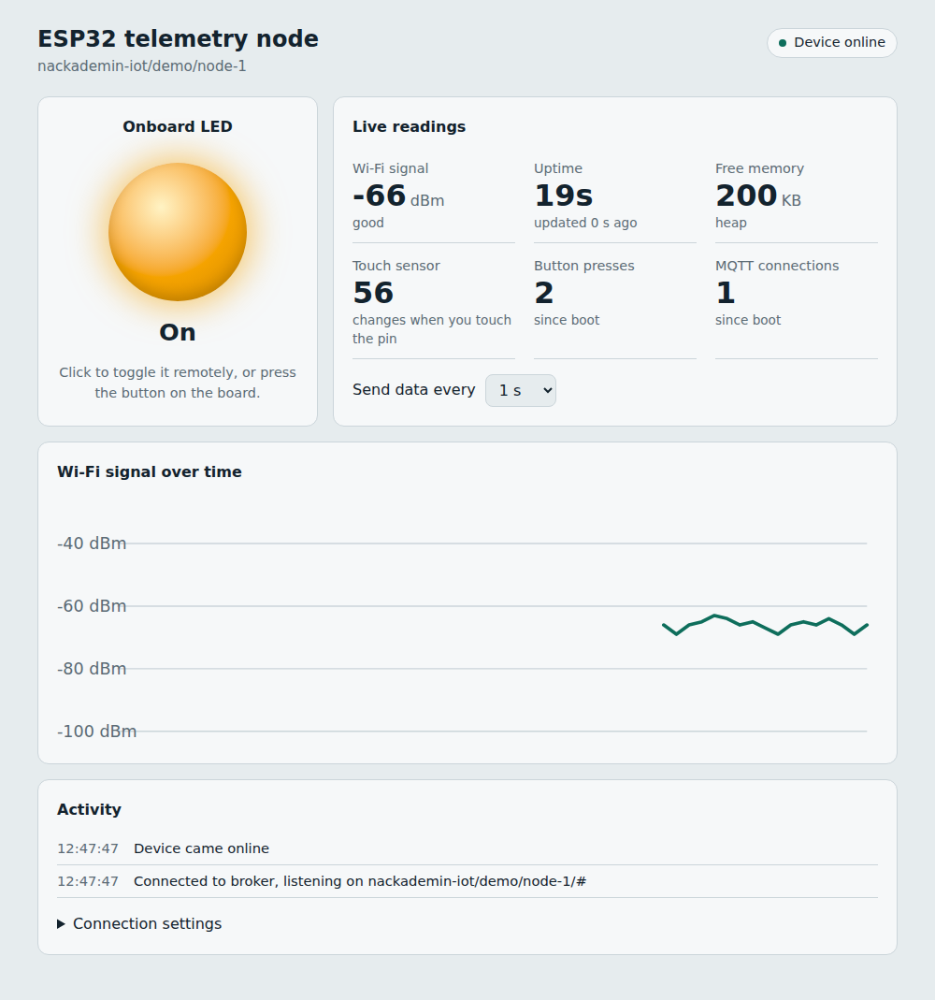
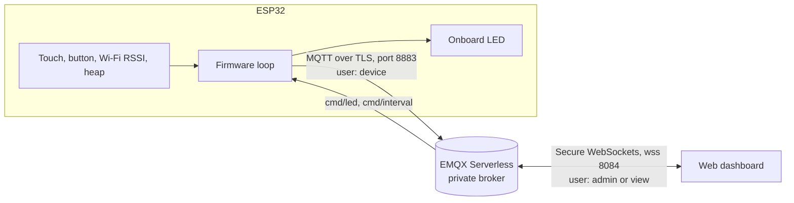

# ESP32 MQTT telemetry node

An ESP32 that streams live telemetry over MQTT and can be controlled remotely from a web dashboard. Built with PlatformIO (Arduino framework), PubSubClient and ArduinoJson. No sensors needed: it uses the board's built-in Wi-Fi radio, capacitive touch and LED, plus a jumper wire as a button. Runs on the Arduino Nano ESP32 (ESP32-S3) and the classic ESP32 DevKit.
The connection is encrypted with TLS, every client signs in with its own user, and the broker decides who may read and who may control.



## What it does

- Publishes telemetry as JSON every few seconds: Wi-Fi signal (RSSI), uptime, free heap, touch sensor value, LED state, button count and number of MQTT connections.
- Accepts commands over MQTT: turn the LED on/off/toggle, and change how often data is sent (1 to 3600 s).
- Reports online/offline status using an MQTT **Last Will** message, so the dashboard knows when the device drops off.
- Pressing the button (a wire from D2 to GND on the Nano, the BOOT button on a DevKit) toggles the LED locally and publishes an event, and the dashboard stays in sync.
- Recovers on its own: Wi-Fi and MQTT reconnect in the background with exponential backoff, without blocking the main loop.

## Security

The first version used a public test broker: no password, no encryption, and anyone who guessed the topic could read the data or switch the LED. This version fixes that in three layers.

**1. Encryption (TLS).** The device connects on port 8883 and the dashboard over secure WebSockets (`wss://`, port 8084), so nothing travels in plain text. The ESP32 also verifies the broker's certificate against the DigiCert root CA in `root_ca.h`, so a fake broker cannot impersonate the real one. Before connecting it syncs its clock over NTP, because certificate dates cannot be checked while the board thinks it is 1970.

**2. Authentication.** The broker (EMQX Serverless) does not allow anonymous clients. Each client has its own user:

| User | Used by | Can read data | Can send commands |
|---|---|---|---|
| `device` | the ESP32 | yes | (receives them) |
| `admin` | me, in the dashboard | yes | yes |
| `view` | anyone I want to show it to | yes | **no** |

If the board were lost, only the `device` user would need to be revoked.

**3. Authorization.** A broker rule denies publishing for `view`. The dashboard also greys out the controls for that user, but that is only for convenience: the broker is what enforces the rule.

Other details:

- The dashboard never saves the password. It only keeps it in memory while the page is open.
- On a wrong password, both the device and the dashboard stop retrying instead of hammering the broker.
- Secrets stay out of git: `config.h` (Wi-Fi and MQTT passwords) is in `.gitignore`.

## Architecture



### Topics

All topics live under `TOPIC_PREFIX/DEVICE_NAME` (for example `nackademin-iot/alex/node-1`).

| Topic | Direction | Payload |
|---|---|---|
| `.../status` | device → broker | `online` / `offline` (retained, offline via Last Will) |
| `.../telemetry` | device → broker | JSON, see below |
| `.../event` | device → broker | `{"type":"button","count":3,"led":true}` |
| `.../cmd/led` | broker → device | `on`, `off` or `toggle` |
| `.../cmd/interval` | broker → device | seconds, `1` to `3600` |

Example telemetry message:

```json
{"device":"node-1","uptime_s":842,"rssi_dbm":-61,"free_heap":214532,"led":true,
 "interval_s":5,"reconnects":1,"button_count":3,"touch":64}
```

## Getting started

**You need:** an Arduino Nano ESP32 or a classic ESP32 DevKit, a USB cable, a jumper wire, and [PlatformIO](https://platformio.org/) (the VS Code extension is easiest).

| | Arduino Nano ESP32 | ESP32 DevKit |
|---|---|---|
| PlatformIO env | `nano_esp32` (default) | `esp32dev` |
| LED | built-in `L` LED (D13) | GPIO 2 |
| Button | wire from D2 to GND | BOOT button (GPIO 0) |
| Touch | pin A0 | GPIO 4 |

1. Clone the repo and create your config file:
   ```bash
   git clone https://github.com/<your-username>/esp32-mqtt-telemetry.git
   cd esp32-mqtt-telemetry
   cp include/config.example.h include/config.h
   ```
2. 2. Edit `include/config.h`: set your Wi-Fi, your EMQX address (`MQTT_HOST`), the `device` user's password and a `TOPIC_PREFIX`. You need a free [EMQX Serverless](https://www.emqx.com/en/cloud/serverless-mqtt) deployment with three users: `device`, `admin` and `view`.
3. Build, flash and open the serial monitor:
   ```bash
   pio run -t upload            # add -e esp32dev for a DevKit
   pio device monitor
   ```
4. Open `dashboard/index.html` in a browser, open **Connection settings** and enter your `TOPIC_PREFIX/DEVICE_NAME`. You can also pass it in the URL: `index.html?topic=nackademin-iot/alex/node-1`. Sign in with `admin` to control the device, or `view` to only watch.

Using a different board? Add an environment to `platformio.ini` and set the pins in `config.h`. On chips without capacitive touch, the touch reading is skipped automatically at compile time.

### Live demo with GitHub Pages

Enable GitHub Pages for the repo (Settings → Pages → deploy from the `main` branch, root folder). The dashboard is then available at `https://<your-username>.github.io/esp32-mqtt-telemetry/dashboard/?topic=<your-topic>`.

### Testing without hardware

`tools/simulate_device.py` speaks exactly the same protocol as the firmware, so you can develop the dashboard without a board plugged in:

```bash
pip install "paho-mqtt>=2.0"
python tools/simulate_device.py --topic nackademin-iot/alex/node-1
```

## Design decisions

- **Non-blocking loop.** Nothing uses `delay()` or waits for the network. Wi-Fi, MQTT, the button and telemetry are all driven by `millis()` timers, so a lost connection never freezes the button or the LED.
- **Exponential backoff** on MQTT reconnects (1 s up to 30 s) to avoid hammering the broker when it is unreachable.
- **Last Will and Testament** plus a retained `online` message, so any client that subscribes later still gets the current status.
- **Secrets stay out of git.** `config.h` is in `.gitignore`; only `config.example.h` is committed. The build stops with a clear error message if `config.h` is missing.
- **State is echoed back.** After each command the device publishes fresh telemetry, so the dashboard shows the device's real state instead of assuming the command worked.

## Limitations and next steps

- Switch the broker to whitelist mode ("deny by default"), so each user can only reach its own topics.
- The device password is compiled into the firmware; per-device client certificates would be safer.
- Add a real sensor (for example a BME280 for temperature, humidity and pressure).
- Over-the-air (OTA) firmware updates.
- Deep sleep for battery-powered operation.
- Store history in a time-series database (InfluxDB) and visualise it in Grafana.

## What I learned
Hello!
This was only a personal project that I had private. Just to have something to show when I share my GitHub.
If you know me and you see this project and have some doubts about or something that I can do better just tell me, I want to learn more.
When I did this project took me 2 weeks for complete it. It was really difficult when I was beginning with MQTT's but the with some logic was more understandable.
Thanks for see it. :)


